layout:true

  
  
Thinking With Data: Leveraging Analytics to Better Define & Solve Problems

  

    
    
      
      

--

class: center,middle

# Thinking With Data: Leveraging Analytics to Better Define & Solve Problems

- - -

## Facilitator: Richard Dunks

### Follow along at: https://bit.ly/think-with-data

#### See the code at: https://github.com/Datapolitan-Online-Tutorials/ThinkingWithData

<strong><strong>Thinking With Data: Leveraging Analytics to Better Define & Solve Problems</strong></strong> by <a xmlns:cc="http://creativecommons.org/ns#" href="http://www.datapolitan.com" property="cc:attributionName" rel="cc:attributionURL">Richard Dunks</a> is licensed under a <a rel="license" href="http://creativecommons.org/licenses/by-sa/4.0/">CC BY-SA 4.0 International License</a>

---

class:center,middle
# Welcome

---
exclude:true
# [Zoom Drill](https://vimeo.com/407215417)
???
+ Facilitators will cover the following skills: muting themselves, stopping their video, typing in chat box, raising their hand, sharing their screen
+ Mute and Unmute your microphone
+ Start and Stop your video
+ Post a message in the Chat window with your name and computer operating system (Windows or MacOS)
+ Click the Participants window and Raise your hand 

---

# A Few Ground Rules
???
+ Facilitators establish the intention we have for the culture of the classroom

--

+ Step up, step back
--

+ One mic
--

+ Be curious and ask questions in the chat
--

+ Assume noble regard and positive intent
--

+ Respect multiple perspectives 
--

+ Be present (phone, email, social media, etc.)

---

# Agenda
--

+ Welcome
--

+ Ground Rules
--

+ Introductions
--

+ Purpose
--

+ What Makes Us Data Driven?
--

+ How Do We Think With Data?
--

+ Final Thought
--

+ Q&A
--

## <a href="https://bit.ly/think-with-data-slides" target="_blank">Click to download a PDF of the slides</a>

---
exclude:true

# Have a question?

https://bit.ly/twd-questions

---

# Getting to Know You
???
+ An opportunity to get to know the participants
+ Intended to create a more relaxed atmosphere for everyone
--

In the chat, let us know:
--

+ Who you are
--

+ Where you're coming from
--

+ Who you work for
--

+ One place you'd like to be right now for a relaxing getaway vacation

<!-- 

.center[.caption[Photo by <a href="https://unsplash.com/@upgradedpoints?utm_source=unsplash&utm_medium=referral&utm_content=creditCopyText">Upgraded Points</a> on <a href="https://unsplash.com/s/photos/vacation?utm_source=unsplash&utm_medium=referral&utm_content=creditCopyText">Unsplash</a>]]
 -->
---

# Getting to Know Me
--

+ Who you are -> Richard Dunks
--

+ Where you're coming from -> Dallas, TX
--

+ Who you work for -> Datapolitan LLC
--

+ One place you'd like to be right now for a relaxing getaway vacation -> Thailand

---

# Testing Zoom Reactions
???
+ A simple exercise to get participants used to 
--

--

+ If you like beaches, give me a thumbs up
--

+ If you don't like beaches, give me a thumbs down
--

+ We'll be using reactions for feedback in our talk today

---

# More About Me
--

+ Almost 20 years experience as a public sector analyst
--

+ 2014 graduate of NYU's Center for Urban Science and Progress
--

+ Provide support and training in data literacy, analytics, visualization, user research, design thinking, machine learning, and data-driven leadership
--

+ Former adjunct professor at Columbia University and Pratt Institute
--

+ Currently an adjunct professor at Tulane University

---

# Purpose
???
.caption[Photo by <a href="https://unsplash.com/@albovsky?utm_source=unsplash&utm_medium=referral&utm_content=creditCopyText">Gleb Albovsky</a> on <a href="https://unsplash.com/s/photos/cheerleader?utm_source=unsplash&utm_medium=referral&utm_content=creditCopyText">Unsplash</a>]
--

+ There's a lot of "cheerleading" for data
--

+ I'm assuming you've gotten a lot of these talks already
--

+ We don't often talk about why we aren't more data driven
--

+ My hope is to do that today

---

# Time for a Poll

> The biggest barrier to being more data-driven on my team is:
+ Our leadership
+ Our team
+ Our tools
+ Our data
+ Our organizational culture

---

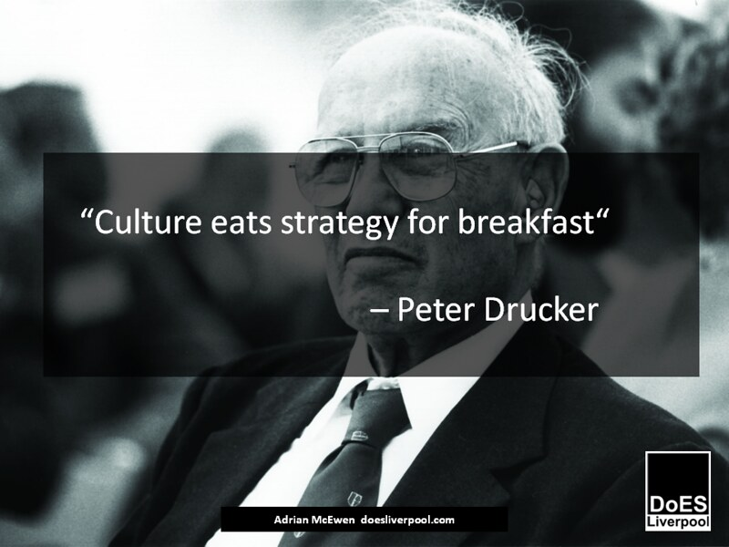
.caption[[Image](https://www.flickr.com/photos/doesliverpool/19889795436) courtesy of Flickr user [DoES Liverpool](https://www.flickr.com/photos/doesliverpool/), license [CC BY-SA 2.0](https://creativecommons.org/licenses/by-sa/2.0/)]
--

## .center[Agree or disagree using Zoom reactions]
---

# It's not the tools
???
+ We all have Excel on our machines or can download [OpenOffice](https://www.openoffice.org/) or [LibreOffice](https://www.libreoffice.org/), not to mention Google Sheets
+ Spreadsheets are powerful tools and widely used
--

.caption[[Image](https://www.flickr.com/photos/jonathanharford/9068101086/in/photolist-ePjows-g4aTJ-3rvTy2-5tRyjt-fsxC7-dP9ggC-edLvWR-GzCWY-cV2221-cV22kb-cV21QN-2mGp7D-ecfM8E-cXM211-4poPnU-J4FKF3-2ekTcjo-2fsvLTZ-2uF2vY-2uACFB-2uF2nq-2uAD26-2uACRp-dkRHyw-3AGPo-4nAZgX-cHHqP3-TiJ3bh-SVPLT-23tNq9C-NaWyCh-cZBmCG-e69det-RG9vcX-e69sTV-e6eRKm-cZFxgJ-d1fGvu-cZGhUo-2kR8vZP-RfYiE-DeuGGU-qYGzbD-an1beS-2gum12x-fo4MR-2gSVbRk-2maSq3Y-2m7tUaY-2jBgpgE) by Flickr user [Jonathan Harford](https://www.flickr.com/photos/jonathanharford/), license [CC BY-NC 2.0](https://creativecommons.org/licenses/by-nc/2.0/)]

---

# London Whale
--

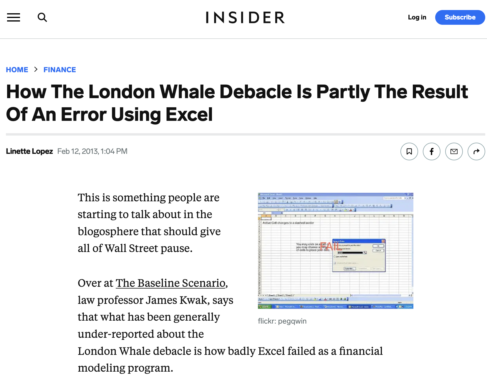

.caption[[How The London Whale Debacle Is Partly The Result Of An Error Using Excel](https://www.businessinsider.com/excel-partly-to-blame-for-trading-loss-2013-2)]
???
+ Billions and billions of dollars are managed using spreadsheets. They may not be managed well but they are managed.
+ Federal Reserve policy is dictated by analysis done largely in spreadsheets. Not only the US market, but the entirity of the global financial system is run on spreadsheets
+ Key Lesson: We have the basic tools we need

---

# It's not the data
--

<!-- --

.caption[Photo by <a href="https://unsplash.com/@mbaumi?utm_source=unsplash&utm_medium=referral&utm_content=creditCopyText">Mika Baumeister</a> on <a href="https://unsplash.com/photos/Wpnoqo2plFA?utm_source=unsplash&utm_medium=referral&utm_content=creditCopyText">Unsplash</a>]

--- -->

???
+ A past student told me it was easier for her to go through the open data portal than another office in her own agency
+ We had some challenges with a support platform & this poor guy had to scrape through chat logs for performance data
+ We started with a gut feeling and then collected the data to prove what we knew was going on
+ Key lesson: the data is there, you just may have to work at getting it

---

# It's not the people
--

.caption[Photo by <a href="https://unsplash.com/@elijahjmears?utm_source=unsplash&utm_medium=referral&utm_content=creditCopyText">Elijah Mears</a> on <a href="https://unsplash.com/s/photos/parking-meter?utm_source=unsplash&utm_medium=referral&utm_content=creditCopyText">Unsplash</a>]

???
+ The NYC Department of Transportation started an analysis unit staffed with parking meter collectors
+ They were the ones actually dodging traffic 
+ They had little training or experience but they figured out ways to get the analysis done because they wanted to know that if they were going to a meter, it was worth going to
+ Key lesson: people will find a way to accomplish the task of working with data

---

# It's not (just) the leadership
--

.caption[[Source](https://www.cbsnews.com/newyork/news/downed-tree-clean-up/)]

???
+ The inability to track and correlate work order requests digitally meant the NYC Parks department had little idea how much work really needed to be done
+ They couldn't provide accurate estimates to the elected leaders or the public
+ The failure to manage this well in regular time meant they were dramatically underprepared in a crisis
+ Key Lesson: leadership are just as affected by a lack of a data driven culture as those on the front lines

---

# It's the Culture
--

.caption[[Image](https://www.flickr.com/photos/doesliverpool/19889795436) courtesy of Flickr user [DoES Liverpool](https://www.flickr.com/photos/doesliverpool/), license [CC BY-SA 2.0](https://creativecommons.org/licenses/by-sa/2.0/)]

???
+ How do you feel about this now?

---

# What is Culture?

> The way of life, especially the general customs and beliefs, of a particular group of people at a particular time.
+ [Cambridge Dictionary](https://dictionary.cambridge.org/us/dictionary/english/culture_)
--

## Best summed up as the prevalent beliefs, values, and norms of that group.

---

# Creating Data-Driven Culture
--

> “Do you have data to back that up?” should be a question no one is afraid to ask and everyone is prepared to answer.
+ [Julie Arsenault](https://www.pagerduty.com/blog/how-to-create-a-data-driven-culture/)
--

## This is the essence of what it means to think with data

---

# Creating Data-Driven Culture
???
+ The inspiration of this part of the talk
+ Carl lists these out but I'm organizing them into principle and composite elements
+ This emphasizes the more foundational nature of some of these ideas.
--

<a href="https://www.oreilly.com/library/view/creating-a-data-driven/9781491916902/" target="_blank">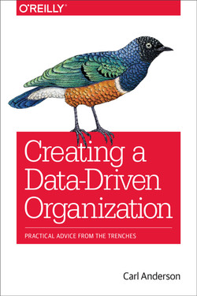</a>

---

# Creating Data-Driven Culture
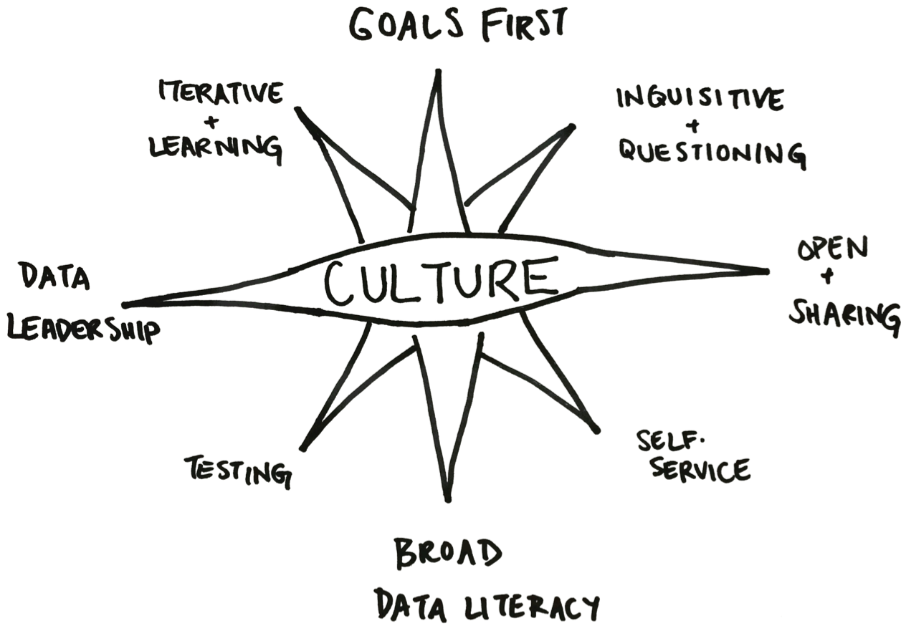
.caption[Drawing by [Julia Marden](https://www.tinypanther.com/)]

---

# Creating Data-Driven Culture
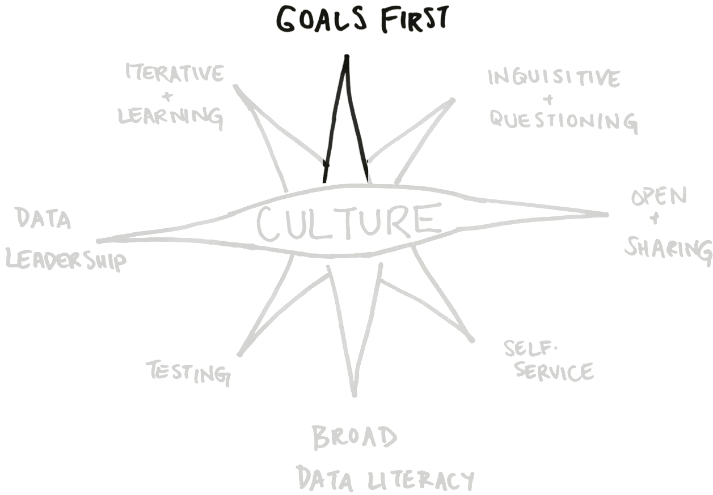
.caption[Drawing by [Julia Marden](https://www.tinypanther.com/)]

???
+ Goals are essential to orient the work of an organization
+ Without goals, there can be a lot of activity but very little movement
+ What are some of our barriers to setting goals?

---

# Creating Data-Driven Culture
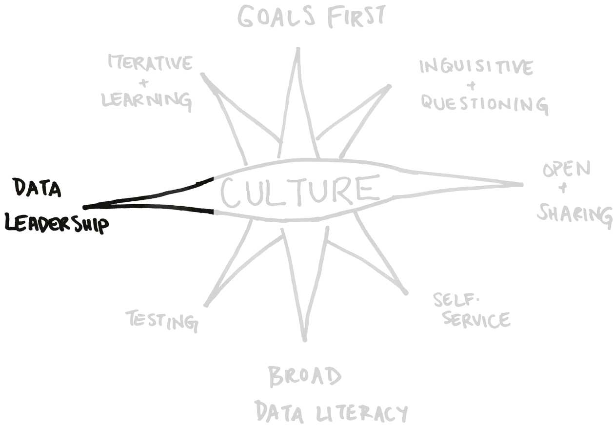
.caption[Drawing by [Julia Marden](https://www.tinypanther.com/)]

???
+ Just hiring a Chief Data Officer is insufficient
+ There must be space made for them to do their job
+ Everyone is a data leader by the example they set
+ What keeps leaders from stepping into this role?

---

# Creating Data-Driven Culture
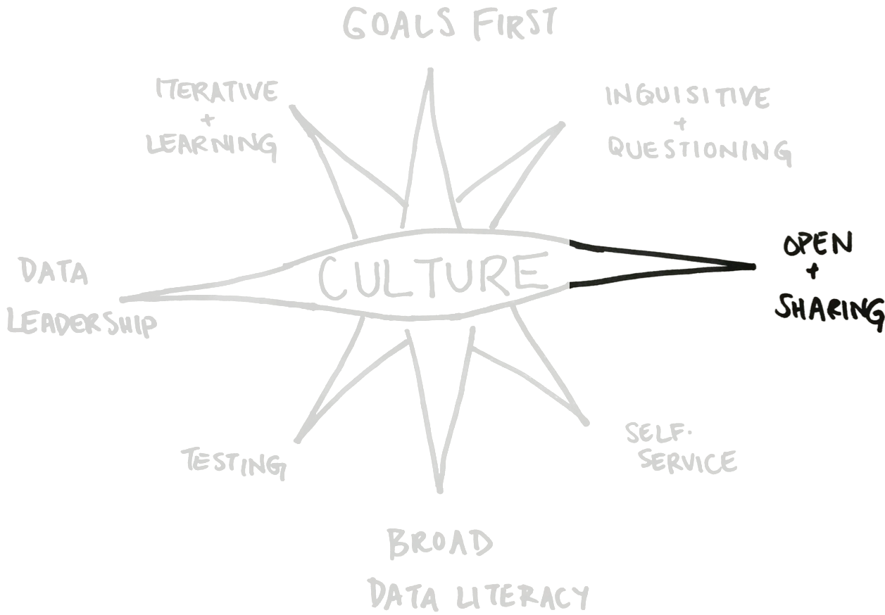
.caption[Drawing by [Julia Marden](https://www.tinypanther.com/)]

???
+ Government isn't known for being open and sharing, but it's essential that we document and share context with others
+ What gets in the way of being open and sharing in government?

---

# Creating Data-Driven Culture
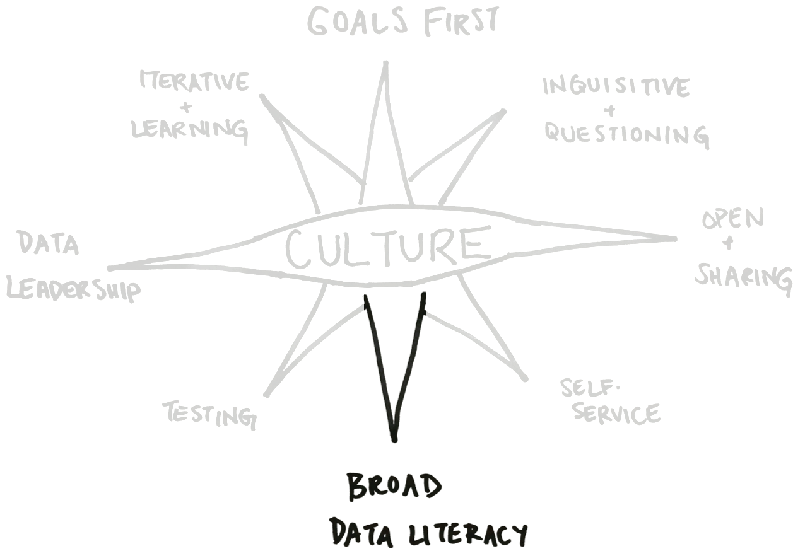
.caption[Drawing by [Julia Marden](https://www.tinypanther.com/)]

???
+ Everyone needs to have a basic comfort with numbers, charts, and graphs
+ Without that comfort, work will either be ignored or accepted uncritically
+ What are the barriers to broad data literacy?

---

# Creating Data-Driven Culture
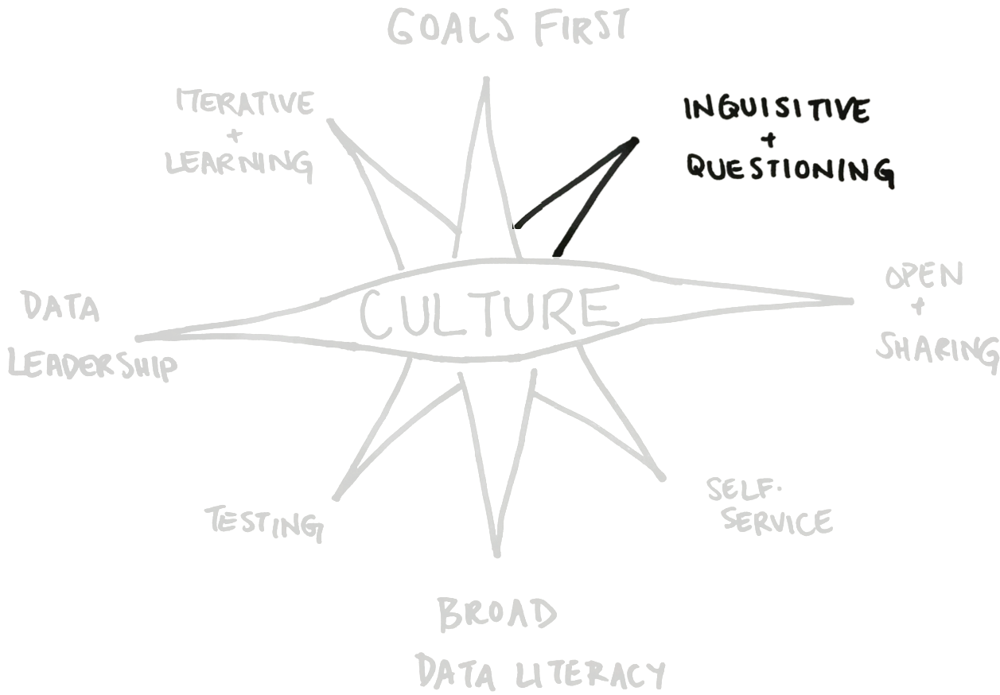
.caption[Drawing by [Julia Marden](https://www.tinypanther.com/)]

???
+ Understanding the goals and having the context allows us to ask questions and be curious about the work

---

# Creating Data-Driven Culture
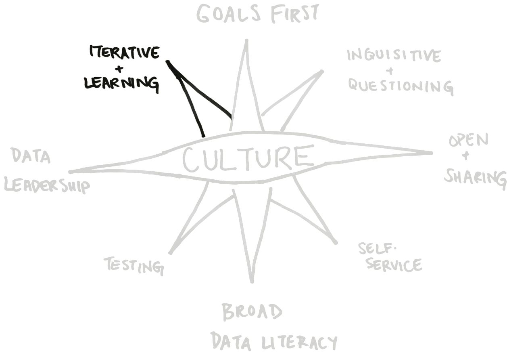
.caption[Drawing by [Julia Marden](https://www.tinypanther.com/)]

???
+ With leadership and an understanding of the goals, we can be iterative and learn from our experiences as we move towards accomplishing them
+ The zero-deficit mentality doesn't help with this

---

# Creating Data-Driven Culture
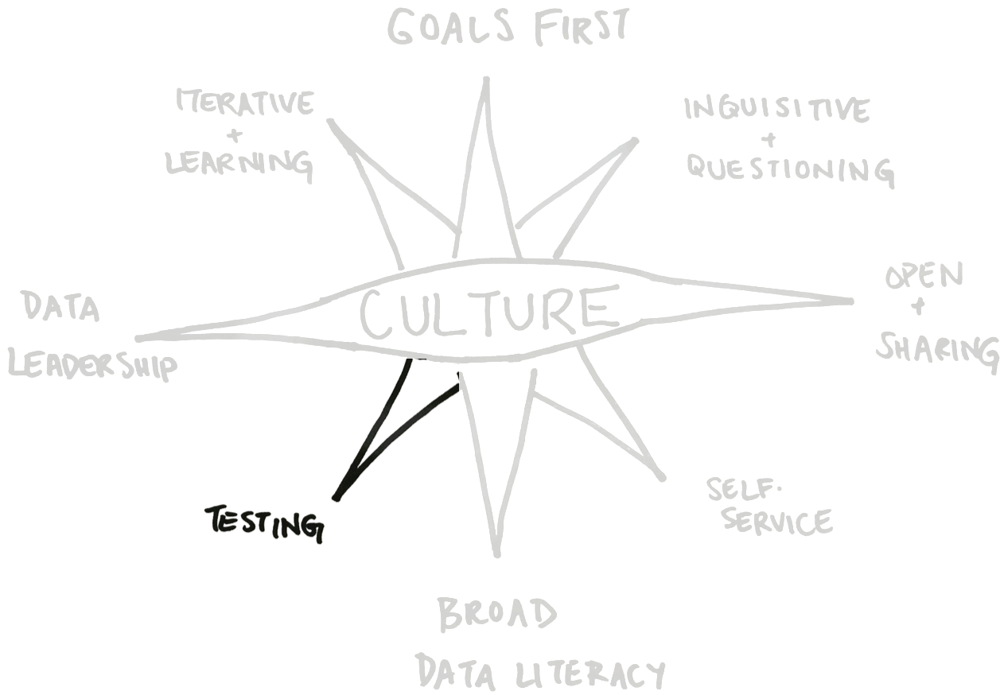
.caption[Drawing by [Julia Marden](https://www.tinypanther.com/)]

???
+ Having the leadership and the broad data literacy allows us to meaningfully test our assumptions

---

# Creating Data-Driven Culture
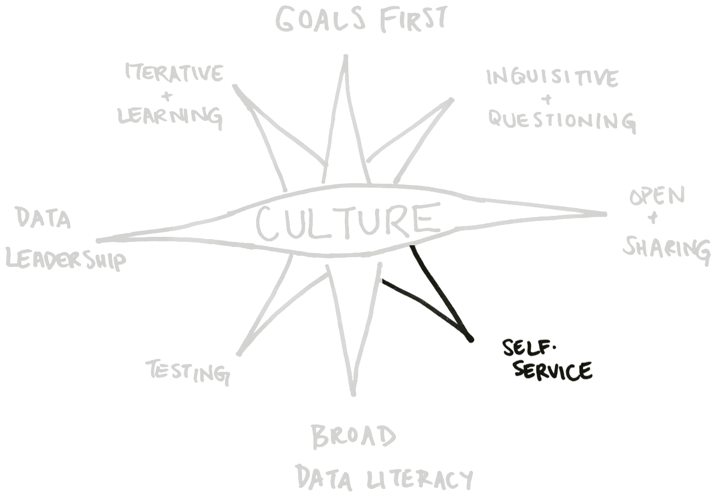
.caption[Drawing by [Julia Marden](https://www.tinypanther.com/)]

???
+ Having access to the data we need when we need it is essential to being inquisitive, iterative, and able to test assumptions. 
+ Delays in accessing data or the need for unnecessary approvals/justifications inhibit innovation and exploration

---

# Creating Data-Driven Culture
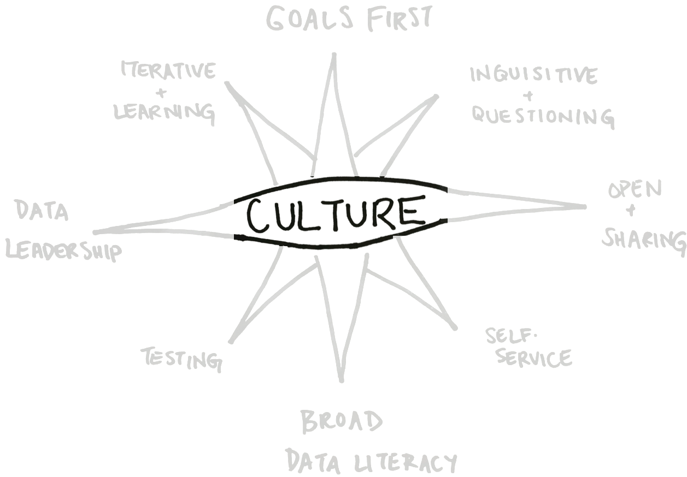
.caption[Drawing by [Julia Marden](https://www.tinypanther.com/)]

---

# Creating Data-Driven Culture

.caption[Drawing by [Julia Marden](https://www.tinypanther.com/)]

---

class:middle

> “Do you have data to back that up?” should be a question no one is afraid to ask and everyone is prepared to answer.
+ Julie Arsenault

.caption[[Source](https://www.pagerduty.com/blog/how-to-create-a-data-driven-culture/)]

---

class: middle, center
# So What Does This Culture Look Like?

---

# Some Key Beliefs
--

+ Data is a useful guide and should be used whenever possible
--

+ Everyone can use data and should have access to the tools and information they need to be successful
--

+ No one knows everything and we do this work better together

---

# Some Key Values
--

+ A single-source of reliable truth (centralized datastores, inspectible data cleaning processes, etc.) over distributed and differing information sources
--

+ Tested hypotheses over untested assumptions 
--
(and the ability to discern the difference)
--

+ Constant improvement in how things are measured, evaluated, and communicated

---

# Some Key Norms
--

+ Asking "what's the data on this tell us?"
--

+ Offering up data even when it's not explicitly asked for
--

+ Deferring judgement until the data is ready (if possible)
--

+ Answering questions without the data should feel uncomfortable or at least not be the norm

---

class:center,middle

# So Why Isn't this easier?

---

# Line staff
--

+ Much of their **perceived** value is in their skill and knowledge
--

+ Their judgement is relied on for sound decision making
--

+ They often work in siloes and are respected for the work they do (no matter how inefficient)
--

+ People drawn to government work do so because often they value continuity and consistency
--

## They can feel pushed aside
---

# Leadership 
--

Leaders often attain their position because:
--

+ They were highly skilled and knowledgeable
--

+ Their judgement could be relied on for sound decision making
--

+ They were rewarded for knowing all the answers
--

+ They like being in control
--

## They can feel like they're losing control

---

class: center, middle
# Some thoughts on how to manage this change

---

# What NOT to do
--

+ Start the conversation telling colleagues what they "should" or "have to do" 
--
-> _Tell them what data will enable_
--

+ Tell them they need to measure everything 
--
-> _that will just lead to exhaustion if you aren't [measuring what matters](https://www.whatmatters.com/)_
--

+ Promise them everything will be solved with data 
--
-> _it won't and when it doesn't, you have even less support for being data driven than you started out with_

---

# Getting Buy-in 
--

+ Start small
--

+ Set a good example
--

+ Have tangible results
--

## The value of being more data-driven should be self-evident and speak for itself

---

# Getting Buy-in

We should be able to show a data-driven approach is:
--

+ more efficient
--

+ more reliable
--

+ provides repeatable results towards outcomes 
--

## If not, we may not be doing it right

---

# Getting Buy-in
--

+ Have patience 
--

+ Have empathy
--

+ Know this isn't easy work, but is important

---

# Final Thought
--

## Centering data more in our conversations is what can help us towards creating a more fair, equitable, and just society in which everyone benefits
--

> If we have data, let’s look at data. If all we have are opinions, let’s go with mine.

> + Jim Barksdale, former Netscape CEO

<!-- Good leaders not only get the **right tools** and the **right data** to the **right people** so they can provide results, but also take seriously their role in **reinforcing the culture of thinking with data** in all they do

A truly data-driven culture will value getting the right tools and the right data to the right people to achieve meaningful results that will be acted upon

 -->
---

# Contact Information
+ [Email me](mailto:richard[at]datapolitan[dot]com)
+ Connect on [LinkedIn](https://www.linkedin.com/in/richarddunks/)

---

# Time for Feedback
--

## Hannah will be sharing a link in the chat for your feedback

---

# Questions
<iframe src="https://app.sli.do/event/4gc6UmshpV5xzQw8o2WjoE" height="80%" width="95%" frameBorder="0" style="min-height: 460px;" title="Slido"></iframe>

---

class:middle,center
# Thank You!

---

# Analytics Value Chain

.caption[Drawing by [Julia Marden](https://www.tinypanther.com/)]

